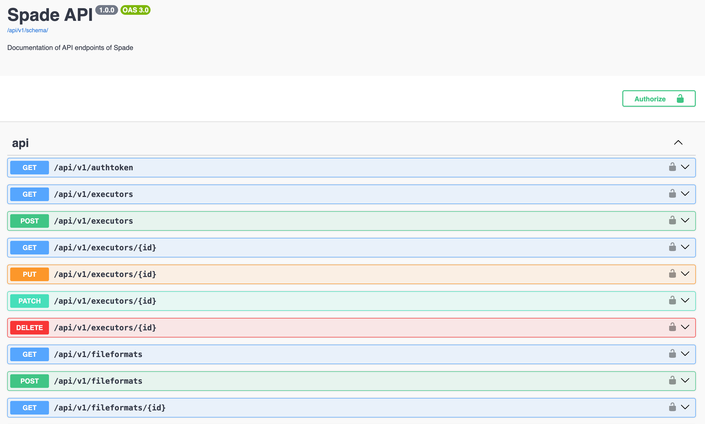

# API

Spade backend exposes a standard REST API based on Django Rest Framework.
If you login to the Django Admin, and next navigate to the root of your backend,
you should see a standard Swagger documentation that looks like this:

