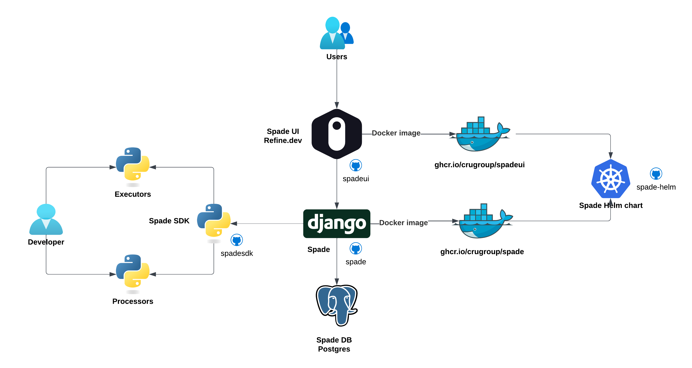

# Architecture

Spade is very similar to any modern app. It consists of the following components:
* Frontend - written in Refine.dev (React)
* Backend - written in Django
* Metastore DB - only Postgres is supported
* Spade SDK - simple interface written in pure Python

The diagram below shows the architecture of Spade:

