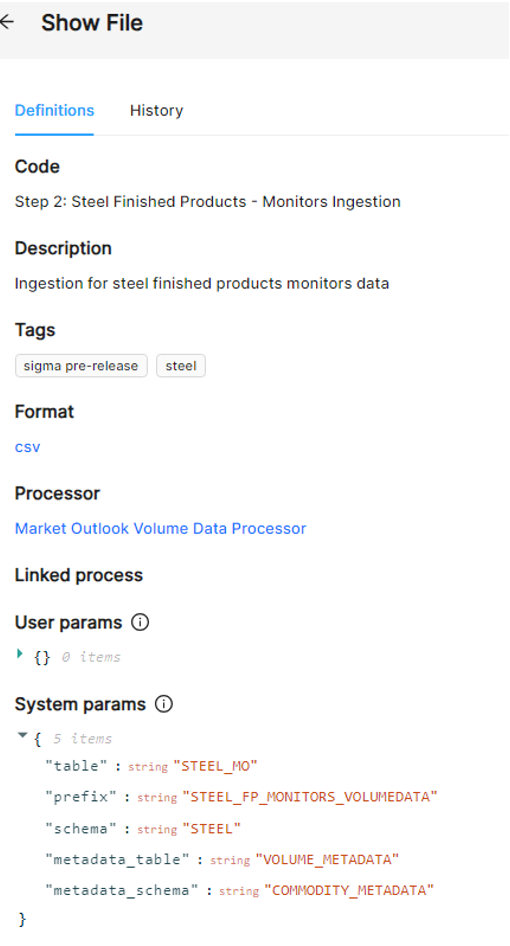
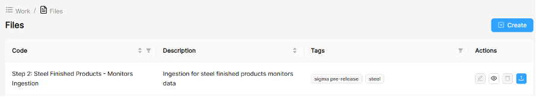
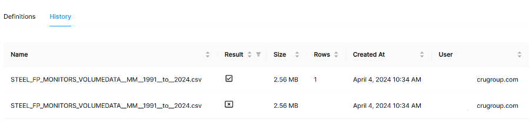

# Defining Files

A **File** is defined by setting up instructions into what it does, that means defining the **Processor** that it will run, a description on what it does, tags for easy filtration if it is part of multiple steps, the format, the linked **Process** that will run on upload, and any specific system parameters needed for the run. For example, below you can see a file definition that is specific to an sample CSV file ingestion. Spade stores all the parameters needed for the that process to upload the data to the correct database table, which are next passed to the **Processor**.

You can define files by hitting the create button as seen below. Special permission might be required (Admin).

To edit/view, delete or run the process after definition you can use the Actions icons (see below).

A history of usage is stored automatically (click on History to see who ran that process)

