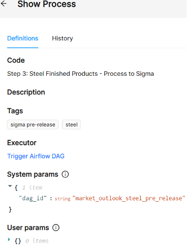

# Defining Processes

To define a process follows these steps:
* Define a name for the process under Code (ex: Step 3: Steel Finished Products - Process to Sigma).
* Add a description of what this process does (optional)
* Sett the tags (optional)
* Select the **Executor** - the script that will be triggered by this process (Trigger Airflow DAG in the example below).
* Configure system and user parameters

